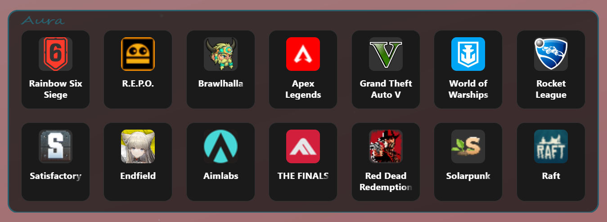

# Aura

Aura is a simple, extremely performance-efficient game launcher. Just Drag & Drop your game shortcuts onto Aura and you're good to go.

I made Aura because... well, desktop icons look cluttery, and we like it clean. The next option would have been the Start Menu, but... it sucks. And no, opening a dedicated launcher/store for every single game isn't an option either. So, I built Aura.

I originally made this application for myself and my friends, but it could help others too, so I released it here for anyone who stumbles upon it.

---

---

## 🚀 How to use
- **Add a game**: Simply Drag & Drop the game's shortcut into the window.
- **Move the window**: Drag it by the very top part of the window frame.
- **Reorder cards**: Drag & Drop any card on top of another to move it.
- **Resize & Adapt**: Aura is fully responsive. Resize it into a vertical sidebar, a horizontal bar, or a compact square—it adapts instantly. ([See vertical layout example](assets/vertical-layout.png))
- **Context menu**: Right-click on any game card to open its menu.

## 🎮 Platform Support
The app supports:
- Steam games
- Ubisoft games
- Epic Games
- Files
- Folders

## 🔮 Next steps & Roadmap
- [ ] Game folders support
- [ ] Launching dedicated software for specific games (e.g., Virtual Desktop for VR, peripheral apps for simulators, etc.)
- [ ] Built-in search bar
- [ ] Automatic sorting
- [ ] Quick access to a game's clips folder (for those of us who clip... way too much)

---

## 📦 Download
Get the latest version from the [Releases](https://github.com/lucafeller-dev/Aura-Release/releases) page!

---
If Aura makes your setup smoother and you want to buy me a coffee to support future updates, you can drop a tip here:

